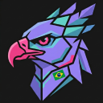
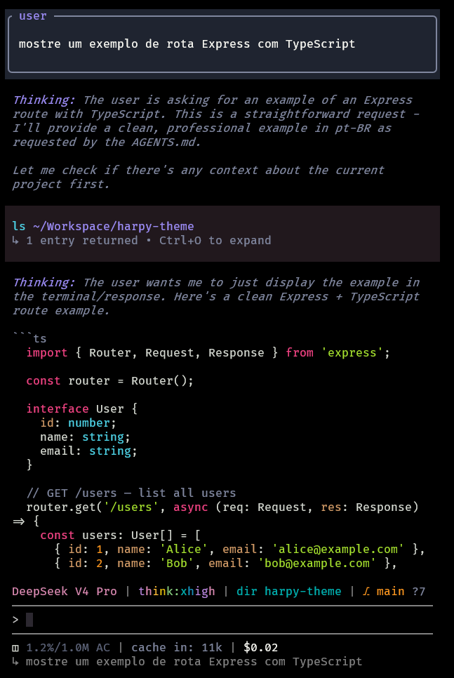
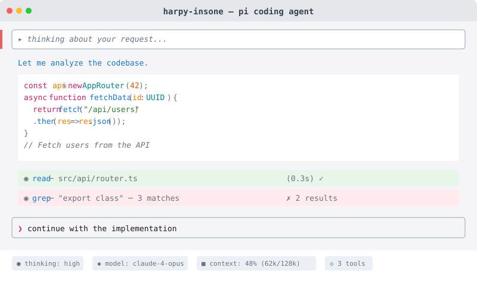
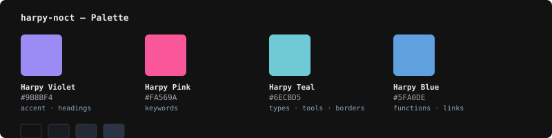
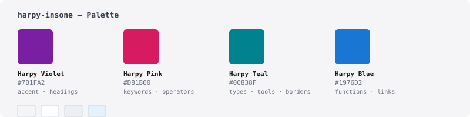

<p align="center">
  
</p>

# Harpy-theme 🦅

Harpy theme for the [pi coding agent](https://pi.dev) — dark (**harpy-noct**) and light (**harpy-insone**) variants.

Inspired by the harpy eagle, apex predator of the Amazon rainforest — **power, precision and elegance**.

## Preview

### harpy-noct (dark)



### harpy-insone (light)



---

## Validation

Contrast and semantic separation are enforced by `test/check-contrast.mjs`:

```bash
npm test
```

`npm test` runs validator regression tests and checks both theme variants. Validation rejects malformed colors, missing required backgrounds, undefined references, and variable cycles before evaluating contrast.

Normal text tokens must pass ≥ 4.5:1 against every surface they may occupy; tertiary tokens must pass ≥ 3:1.
Status hues (success/error/warning) are reserved for status semantics — syntax strings/numbers
use distinct colors, and ramp levels use a violet progression instead of alarm reds.

Search uses a dedicated violet highlight, distinct from the blue selection background, with text contrast ≥ 4.5:1. Optional search colors retain Pi's `text` and `selectedBg` fallbacks. Export metadata (`dim`) must pass ≥ 4.5:1 on explicit `pageBg` and `cardBg` backgrounds before browser opacity is applied. The light theme uses a darker metadata gray for better legibility.

## Installation

From npm:

```bash
pi install npm:harpy-theme
```

## Local development

From a local checkout, copy the current themes into Pi's user theme directory:

```bash
npm run copy:themes
```

This creates `~/.pi/agent/themes` if needed and replaces only `harpy-noct.json` and `harpy-insone.json`. Other themes are left unchanged. Theme sources are resolved relative to the script, not the current working directory. Copying does not publish a package or modify Pi settings.

## Usage

Select via `/settings` or directly in the TUI:

```bash
/theme harpy-noct    # Dark variant
/theme harpy-insone  # Light variant
```

## Signature colors

The 4 exclusive colors that make harpy-theme recognizable:

| Color | Dark | Light | Usage |
|-------|------|-------|-------|
| 🔮 **Harpy Violet** | `#9B8BF4` | `#7B1FA2` | Accent, headings, selections |
| 🌸 **Harpy Pink** | `#FA569A` | `#A91152` | Keywords, labels |
| 🦚 **Harpy Teal** | `#6ECBD5` | `#00626B` | Types, tools, borders, bullets |
| 🌊 **Harpy Blue** | `#5FA0DE` | `#0F57AC` | Functions, links |

### Palettes

| Variant | Palette |
|---------|---------|
| **harpy-noct** |  |
| **harpy-insone** |  |

### Surface colors

```
Background & surface colors (dark → light):

  Background  ████████  #121212  #F5F5F7
  Surface     ████████  #171B22  #FFFFFF
  SurfaceAlt  ████████  #232936  #E6EAF0
  Selection   ████████  #2B3445  #C9E2F6
```

## Highlights

- **🔤 Typography** — normal text validated at ≥ 4.5:1; tertiary text at ≥ 3:1
- **🌡️ Thinking ramp** — cool blue → violet progression for thinking level indicators
- **🌙→☀️ Day & night** — dark and light variants sharing the same visual identity
- **🦅 Brazilian identity** — crafted as a pi theme, inspired by Amazon wildlife

## License

MIT © [bscordeiro](https://github.com/bscordeiro)
